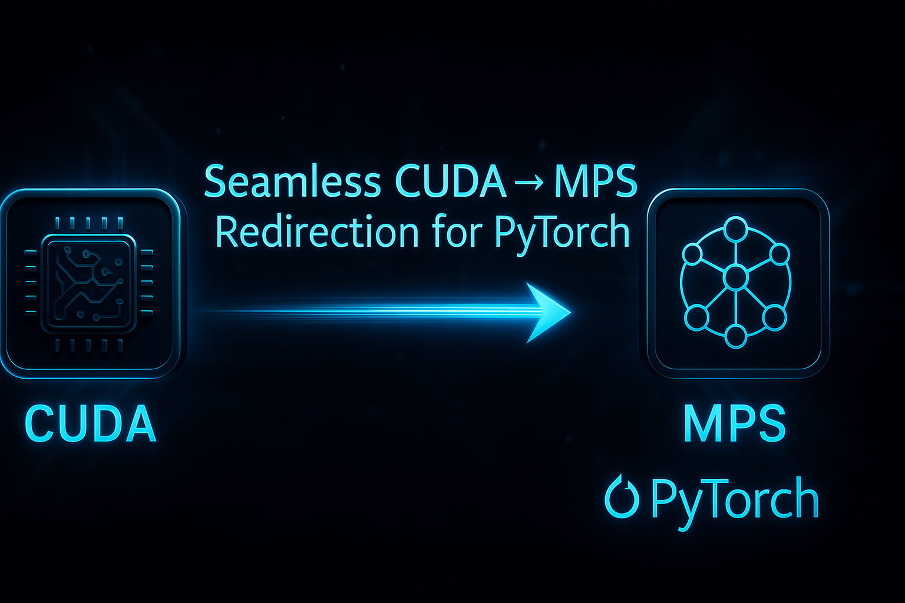

# TorchDevice



A Python library for transparent device handling in PyTorch, enabling seamless transitions between CUDA and MPS devices.

## Overview

TorchDevice provides transparent device handling for PyTorch applications, allowing code written for CUDA to run on MPS devices (and vice versa) without modification. It intercepts device-specific calls and redirects them appropriately based on available hardware.

## Features

- **Transparent Device Handling**: Automatically redirects CUDA calls to MPS (and vice versa)
- **Comprehensive PyTorch Integration**: 
  - Neural Network Operations
  - Memory Management
  - Stream and Event Handling
  - Automatic Differentiation
  - Optimization Algorithms
- **Robust Error Handling**: Graceful fallbacks and informative error messages
- **Performance Optimization**: Efficient device-specific implementations
- **Type Safety**: Comprehensive type checking and validation

## Installation

```bash
pip install TorchDevice
```

## Quick Start

```python
import TorchDevice  # This automatically hooks into PyTorch
import torch

# Your existing PyTorch code works as is
model = torch.nn.Linear(10, 10).cuda()  # Will use MPS if CUDA isn't available
```

## Project Structure

The project is organized into three main components:

1. **Core** (`TorchDevice/core/`): Central device handling and patching
2. **Operations** (`TorchDevice/ops/`): Device-specific implementations
3. **Utilities** (`TorchDevice/utils/`): Shared functionality

For detailed structure information, see [Project Structure](docs/project_structure.md).

## Documentation

- [Project Structure](docs/project_structure.md): Detailed project organization
- [TorchDevice Behavior](docs/TorchDevice_Behavior.md): Core functionality and behavior
- [API Reference](docs/TorchDevice_Functions.md): Comprehensive API documentation
- [CUDA Operations](docs/CUDA-Operations.md): CUDA-specific functionality

## Development

### Prerequisites

- Python 3.8+
- PyTorch 2.0+
- For CUDA development: NVIDIA CUDA Toolkit
- For MPS development: Apple Silicon Mac

### Setup Development Environment

```bash
# Clone the repository
git clone https://github.com/yourusername/TorchDevice.git
cd TorchDevice

# Create and activate virtual environment
python -m venv venv
source venv/bin/activate  # On Windows: venv\Scripts\activate

# Install development dependencies
pip install -e ".[dev]"
```

### Running Tests

```bash
# Run all tests
python run_tests_and_install.py

# Run specific test module
python run_tests_and_install.py --test-only tests/[test-name.py]
```

## Contributing

We welcome contributions! Please see our [Contributing Guidelines](CONTRIBUTING.md) for details.

## Supporting This Project

TorchDevice is an open-source project developed and maintained by [Michael P. Sullivan (unixwzrd)](https://unixwzrd.ai). If you find this project useful, please consider supporting its development:

### Funding Options
- [Patreon](https://www.patreon.com/unixwzrd)
- [Ko-Fi](https://ko-fi.com/unixwzrd)
- [Buy Me a Coffee](https://www.buymeacoffee.com/unixwzrd)

### Other Ways to Support
1. **Star the Repository**: Show your support by starring the project on GitHub
2. **Share the Project**: Help spread the word about TorchDevice
3. **Report Issues**: Help improve the project by reporting bugs or suggesting features
4. **Contribute Code**: Submit pull requests to help fix issues or add features
5. **Improve Documentation**: Help keep our documentation clear, accurate, and helpful

For more information about the developer and other projects, visit [Distributed Thinking Systems](https://unixwzrd.ai).

## License

This project is licensed under the MIT License - see the [LICENSE](LICENSE) file for details.

## Changelog

See [CHANGELOG.md](CHANGELOG.md) for a list of changes and version history.