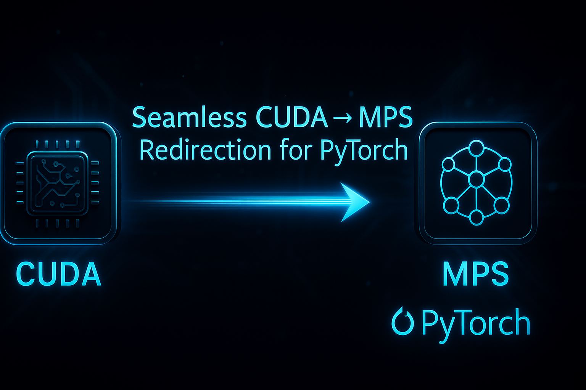

# CHANGELOG

## 0.5.2 - 2025-06-21

### Cleanup, Documentation, and Test Results

### Added

- **Test Automation Framework (`test_automation/`)**:
  - Enhanced `generate_test_report.py` script to improve test file path resolution and clickable links in the Markdown report.
  - Updated `test_automation/README.md` with instructions for setting up and running the Transformers test suite.
  - Updated [README](README.md) with a link to the advanced test automation guide.
  - Updated [CONTRIBUTING](CONTRIBUTING.md) with instructions for running external tests.

## 0.5.1 - 2025-06-20

### Improved

- **Test Reporting**:
  - Enhanced the `generate_test_report.py` script to make test file paths in the Markdown report clickable, improving navigation from the report directly to the source code.
  - Corrected relative link paths to ensure they resolve correctly from the report's location in `test_automation/reports/`.
- **Documentation**:
  - Updated `test_automation/README.md` with a new section detailing required system-level dependencies (Tesseract, image libraries) for running the full Transformers test suite.
  - Added a link in the main project `README.md` pointing to the advanced test automation guide for better discoverability.


## 0.4.2 - 2025-06-08

### Added

- **Test Automation Framework (`test_automation/`)**:
  - Introduced `run_transformer_tests.py`, a versatile script for automating test suite execution for Python projects with `TorchDevice` integration.
  - Key features:
    - Discovers `test_*.py` files within specified target directories (relative to project's `tests/` dir).
    - Executes tests using `python -m unittest -v` in isolated subprocesses.
    - Automatically sets `ACTIVATE_TORCH_DEVICE=1` environment variable to enable `TorchDevice`.
    - Dynamically configures `PYTHONPATH` to include `TorchDevice` and target project's `src/` directory.
    - Generates comprehensive logs:
      - Overall run log with a descriptive name (e.g., `<series>_<timestamp>.log`) in `test_automation/logs/`.
      - Individual test logs (STDOUT/STDERR) in `test_automation/logs/<project_name>/...`.
    - Configurable target project root (`--project_root`) and `TorchDevice` root (`--torchdevice_root`).
    - Designed for general use with Python projects adhering to common test structures.
  - Added `test_automation/README.md` detailing script usage, configuration, and logging.

## 2025-06-06 - 0.4.1 - Attention Test Refactoring

### Improved

- Refactored `tests/test_attention.py` to exclusively use standard PyTorch APIs (`torch.nn.functional.scaled_dot_product_attention`, `torch.nn.MultiheadAttention`, and `transformers.BertSelfAttention`) instead of internal TorchDevice replacement functions. This ensures tests accurately validate TorchDevice's transparent patching capabilities for attention mechanisms.
- Removed direct imports of TorchDevice internal functions from `tests/test_attention.py`.
- Ensured `import TorchDevice` is present in `tests/test_attention.py` to apply patches before test execution.

### Added

- Complete project restructuring with new modular architecture
  - New `core/` module for central device handling
  - New `ops/` module for operation-specific implementations
  - New `utils/` module for shared utilities
- Added comprehensive documentation in `docs/project_structure.md`
- Added new modules for enhanced functionality:
  - Events handling and synchronization
  - Autograd support
  - Optimization algorithms
  - Enhanced stream management

### Changed

- Reorganized existing code into logical modules
- Updated import paths to reflect new structure
- Consolidated patch functionality into core module
- Improved separation of concerns between modules
- Centralized `torch.cuda` RNG (Random Number Generation) patching logic into `TorchDevice/ops/random/generators.py`.
- Refactored `TorchDevice/ops/random/generators.py` to use `DeviceManager` and `hardware_info` for robust, device-aware RNG patching across `torch`, `torch.cuda`, and `torch.mps` namespaces.

  - **Core Patching Refinement**:
    - Further modularized core patching logic within `TorchDevice/core/`:
      - `device.py`: Confirmed `DeviceManager` handles `torch.device` and `torch.load` patching.
      - `tensors.py`: Streamlined for `torch.Tensor` method patching and tensor creation wrappers.
      - `modules.py`: Introduced for dedicated `torch.nn.Module` method patching.
      - `patch.py`: Updated to orchestrate the refined patching sequence from these modules.

### Removed

- Redundant patch implementations
- Deprecated compile-related files
- Removed redundant RNG stubs and patching logic from `TorchDevice/ops/device/cuda.py` as this is now fully handled by `ops/random/generators.py`.

## 2025-05-26 - 0.4.0 - Transformer Support and Attention Mechanisms

### Major Changes

- **Comprehensive Transformer Support**
  - Added full support for transformer model operations
  - Implemented scaled dot-product attention mechanism
  - Added multi-head attention support with BERT compatibility
  - Enhanced device handling for attention operations
  - Added proper type checking and device compatibility
  - Implemented automatic device redirection for attention ops

- **Neural Network Enhancements**
  - Fixed embedding operation issues and improved type safety
  - Enhanced tensor device and dtype management
  - Added proper error handling and fallbacks
  - Improved performance for common operations
  - Added comprehensive tensor type validation
  - Fixed embedding_renorm_ operation issues

- **Architecture Improvements**
  - Centralized neural network operations in `device/nn.py`
  - Added dedicated attention mechanism module in `device/attention.py`
  - Enhanced patch application system for better modularity
  - Improved device redirection for transformer operations
  - Added automatic patch registration for new modules

- **Testing and Validation**
  - Added comprehensive test suite for attention mechanisms
  - Enhanced BERT model compatibility tests
  - Added tests for embedding and linear operations
  - Improved test coverage for layer normalization
  - Added transformer model integration tests
  - Enhanced device compatibility test coverage

### Breaking Changes

- Attention mechanisms now enforce stricter type checking
- Some attention operations may require explicit device specifications
- Neural network operations require proper dtype specifications
- Device handling follows stricter validation rules

### Known Issues

- Some specialized CUDA attention operations may not have direct MPS equivalents
- Performance implications when using attention mechanisms on CPU fallback
- Certain CUDA-specific optimizations may not be available on MPS
- Some transformer operations may require additional memory on MPS devices

### Next Steps

- Optimization of attention operations for different hardware
- Support for more transformer architectures
- Enhanced memory management for large models
- Performance profiling and improvements
- Implementation of additional CUDA-specific features
- Enhanced error reporting and diagnostics

### Testing Notes

We need testers to validate the following scenarios:

1. Large transformer model inference
2. Multi-head attention performance
3. Mixed-precision training with attention
4. Cross-attention mechanisms
5. Causal attention masking
6. Device switching during model execution
7. Memory usage patterns on different devices
8. Performance comparison between CUDA and MPS

Please report any issues or unexpected behavior through the issue tracker.

### Package Updates

- Version updated to 0.4.0 in all relevant files
- Added transformers>=4.30.0 as a dependency
- Updated package classifiers to reflect beta status
- Enhanced package discovery with find_packages()
- Added new module exports in **init**.py

## 2025-05-24 - 0.2.0 - Neural Network Operations and Device Handling Overhaul

### Major Changes

- **Complete Neural Network Operations Refactoring**
  - Centralized all neural network operations in dedicated `device/nn.py` module
  - Added comprehensive type safety and device compatibility checks
  - Implemented proper tensor dtype handling across operations
  - Added support for embedding, linear, and layer normalization operations
  - Fixed critical issues with embedding operations on MPS devices

- **Enhanced Device Management**
  - Improved device redirection logic for better compatibility
  - Added robust type conversion handling for tensor operations
  - Fixed device-specific normalization issues
  - Enhanced memory management for tensor operations

- **Modular Architecture**
  - Reorganized codebase into logical modules for better maintainability
  - Separated device-specific operations into dedicated modules
  - Implemented helper utilities for common tensor operations
  - Improved code reusability and reduced duplication

- **Testing Infrastructure**
  - Added comprehensive tests for neural network operations
  - Enhanced test coverage for device handling
  - Improved test reliability and reproducibility
  - Added transformer model integration tests

### Breaking Changes

- Neural network operations now enforce stricter type checking
- Device handling may require explicit dtype specifications in some cases
- Embedding operations now handle normalization differently

### Known Issues

- Some CUDA-specific operations may not have full MPS equivalents
- Performance implications when falling back to CPU for unsupported operations

### Next Steps

- Implementation of attention mechanisms
- Support for more neural network operations
- Enhanced error handling and diagnostics
- Performance optimizations for device-specific operations

### Testing Notes

We need testers to validate the following scenarios:

1. Transformer model inference on MPS devices
2. Large-scale embedding operations
3. Mixed-precision training workflows
4. Multi-device tensor operations

Please report any issues or unexpected behavior through the issue tracker.

## 2025-03-16 - 0.1.1

### Interim Checkpoint Release

- **Modularization Complete:** All core logic is now modularized into dedicated modules under `TorchDevice/cuda/`.
- **CPU Override Feature Stable:** The `cpu:-1` override is fully implemented, documented, and tested.
- **All Core Tests Passing:** All unit and integration tests for the modularized codebase are passing as of this release.
- **Documentation Updated:** README and developer docs reflect the new structure and features.
- **Next Focus:** Running and validating all example/demo scripts in the `examples/` directory, and expanding user-facing features.

## 2025-03-15 - 0.0.5

### CPU Override Feature

- **Explicit CPU Device Selection**
  - Added new `cpu:-1` device specification to force CPU usage regardless of available accelerators
  - Implemented CPU override flag to ensure all subsequent operations respect explicit CPU selection
  - Enhanced device redirection logic to recognize and honor CPU override requests
  - Simplified device handling logic for better maintainability and reliability

- **Testing Infrastructure Improvements**
  - Separated CPU and MPS tests into dedicated modules to prevent test interference:
    - `test_cpu_operations.py` for testing CPU-specific functionality
    - `test_mps_operations.py` for testing MPS-specific functionality
    - `test_cpu_override.py` for testing the new CPU override feature
  - Fixed device handling in tests to properly isolate test environments
  - Updated expected output files to accommodate new logging patterns
  - Enhanced test robustness with better device state management

- **Device Handling Logic Improvements**
  - Simplified `torch_device_replacement` function with clearer, more declarative logic
  - Enhanced handling of device indices for both string and separated parameter formats
  - Improved input validation to prevent invalid device specifications
  - Streamlined error handling for more robust operation with edge cases

## 2025-03-10 - 0.0.4

### TDLogger Improvements

- **Consolidated Duplicate Code**
  - Added new helper functions to centralize common operations:
    - `contains_important_message()` - Checks if a message contains important patterns that should always be logged
    - `is_setup_or_init()` - Identifies setup and initialization functions for better filtering
    - `format_message()` - Centralizes message formatting for consistency
  - Reorganized code structure for better clarity and maintainability

- **Optimized Message Filtering Logic**
  - Improved the `should_skip_message()` function with clearer, more declarative logic
  - Created constant `IMPORTANT_MESSAGE_PATTERNS` to centralize patterns that should always be logged
  - Enhanced filtering to ensure critical messages are never skipped
  - Simplified complex conditional logic for better readability and maintainability

- **Improved Error Handling**
  - Added robust try/except blocks in `log_message()` to catch and handle exceptions
  - Added error reporting that directs error messages to stderr for easy debugging
  - Ensured exceptions in the logger won't propagate to the main application
  - Fixed edge cases that could cause unexpected behavior during logging

- **Test Framework Enhancements**
  - Improved `PrefixedTestCase` class with clear separation between test messages and TDLogger output
  - Fixed formatting inconsistencies in the test output for better readability
  - Updated expected output files to reflect new logger behavior
  - Enhanced error handling in test utilities

### Test Infrastructure Improvements

- **Created Common Test Utilities Directory**
  - Added `tests/common/` directory to house shared test infrastructure
  - Implemented `test_utils.py` with the `PrefixedTestCase` class providing standardized logging capabilities
  - Moved `log_diff.py` to common location for reuse across all test modules
  - Standardized test setup and teardown procedures across all tests
  - Improved test discoverability and organization

## 2025-03-08 - 0.0.3

### Logger Improvements

- Optimized the `_logged_messages` collection by replacing the set with a fixed-size deque
- This change improves memory management by automatically removing oldest entries when the collection is full
- Eliminates the need to clear the entire collection, providing more consistent duplicate prevention
- Consolidated duplicate code by extracting common logic into helper functions:
  - Added `is_test_environment()` to determine if running in a test environment
  - Added `is_internal_frame()` to identify frames that should be skipped
  - Added `should_skip_message()` to centralize message filtering logic
  - Added `is_setup_or_init()` to identify setup and initialization functions
- Improved caller identification to ensure log messages show the actual caller
- Enhanced message filtering to ensure important redirection messages are always logged

### Test Framework Improvements

- Created a robust test framework with a `PrefixedTestCase` class in `test_utils.py`
- Fixed test discovery and execution to ensure consistent environment variables
- Improved logging during tests with better context and error handling
- Enhanced expected output file management for more reliable test results
- Fixed issues with program name consistency in log messages during tests

## 2025-03-03 - 0.0.2

### Logging System Improvements

- Modularized logging: Moved logging functionality into its own module (`TDLogger.py`)
- Simplified logging interface:
  - Removed verbosity levels (LOG_VERBOSITY) in favor of a simpler on/off approach
  - Eliminated different message classes (warning, info, error) for a more streamlined logging experience
  - Consolidated all logging to use a single `log_message` function as the primary entry point
  - Removed redundant `log` function since the project hasn't been publicly released yet
- Improved caller tracking for more accurate log messages
- Optimized memory usage by limiting the size of the logged messages cache
- Enhanced test suite with expected output validation

## 2024-12-30 - 0.0.1

- Added note regarding building NumPy for Apple silicon.

## 2024-12-12 - Initial release

- Initial release
  - Need other to get involved and help test/make improvements.
# TorchDevice



A Python library for transparent device handling in PyTorch, enabling seamless transitions between CUDA and MPS devices.

## Overview

TorchDevice provides transparent device handling for PyTorch applications, allowing code written for CUDA to run on MPS devices (and vice versa) without modification. It intercepts device-specific calls and redirects them appropriately based on available hardware. This is primarily for migration of existing CUDA code and running existing CUDA code on Apple Silicon Macs.

## Features

- **Transparent Device Handling**: Automatically redirects CUDA calls to MPS (and vice versa)
- **Comprehensive PyTorch Integration**: 
  - Neural Network Operations
  - Memory Management
  - Stream and Event Handling
  - Automatic Differentiation
  - Optimization Algorithms
- **Robust Error Handling**: Graceful fallbacks and informative error messages
- **Performance Optimization**: Efficient device-specific implementations
- **Type Safety**: Comprehensive type checking and validation

## Installation

Clone and install from the repository:
```bash
git clone https://github.com/unixwzrd/TorchDevice.git
cd TorchDevice
pip install -e .
```

## Quick Start

```python
import TorchDevice  # This automatically hooks into PyTorch, order not important.
import torch

# Your existing PyTorch code works as is
model = torch.nn.Linear(10, 10).cuda()  # Will use MPS if CUDA isn't available
```

**NOTE:** The project is under active development and produces very verbose logs, so you may want to redirect them to a file or `/dev/null`. I will be working on reducing the verbosity in the future.

## Project Structure

The project is organized into three main components:

1. **Core** (`TorchDevice/core/`): Central device handling and patching
2. **Operations** (`TorchDevice/ops/`): Device-specific implementations
3. **Utilities** (`TorchDevice/utils/`): Shared functionality

For detailed structure information, see [Project Structure](docs/project_structure.md).

## Documentation

- [Project Structure](docs/project_structure.md): Detailed project organization
- [TorchDevice Behavior](docs/TorchDevice_Behavior.md): Core functionality and behavior
- [API Reference](docs/TorchDevice_Functions.md): Comprehensive API documentation
- [CUDA Operations](docs/CUDA-Operations.md): CUDA-specific functionality
- [Advanced External ProjectTesting](test_automation/README.md): Comprehensive integration testing

## Development

### Prerequisites

- Python 3.8+
- PyTorch 2.0+
- For CUDA development: NVIDIA CUDA Toolkit
- For MPS development: Apple Silicon Mac

### Setup Development Environment

```bash
# Clone the repository
git clone https://github.com/yourusername/TorchDevice.git
cd TorchDevice

# Create and activate virtual environment
python -m venv venv
source venv/bin/activate  # On Windows: venv\Scripts\activate

# Install development dependencies
pip install -e  .
```

### Running Tests

```bash
# Run all tests
python run_tests_and_install.py

# Run specific test module
python run_tests_and_install.py --test-only tests/[test-name.py]
```

### Advanced Integration Testing

The most current project files are in the dev branch and may be accessed from there by checking out the project and then checking out the dev branch.

```bash
# Checkout the project
git clone https://github.com/yourusername/TorchDevice.git

cd TorchDevice

# Checkout the dev branch
git checkout dev
```

If you wish to contribute create a branch and then submit a PR for your changes. I will review them and merge them into the dev branch and then into the main branch as I get to them. I will try to get to them as soon as possible. I appreciate all contributions to making this better.

For comprehensive integration testing against large codebases like Hugging Face Transformers, a dedicated test automation suite is available. This suite manages complex test execution, logging, and reporting. For detailed instructions on setup, dependencies, and usage, please see the dedicated guide:

[**Advanced Test Automation README**](test_automation/README.md)

The latest test reports are in the [test_automation/reports](test_automation/reports) directory. Feel free to have a look and let me know if you have any questions or suggestions.  If you have any fixes, please submit a PR.

## Contributing

We welcome contributions! Please see our [Contributing Guidelines](CONTRIBUTING.md) for details.

It has additional information on testing other projects with TorchDevice, though I have mostly tested and am working on debugging the issues with HuggingFace Transformers. For now, I am focused on getting the core functionality working.  Right now about 13% of the tests are failing and many of those are due to CUDA specific functionality in the CUDA library.

This is not my primary project I am working on, but I am using it for other projects I am working on, giving me access to available PyTorch code written for CUDA and saving time in having to port code over to Apple Silicon.

## Supporting This Project

TorchDevice is an open-source project developed and maintained by [me, M S - unixwzrd](https://unixwzrd.ai). It has evolved and grown over the past 9 months from when it was first conceived, and is now relatively stable and useful for running PyTorch CUDA code on Apple Silicon, and I have tested it with a number of projects. Some projects having to do with Text-to-Speech and other AI/ML projects. My goal right now is to have the HuggingFace Transformers library working with it as much as possible.

If you find this project useful, please consider supporting its development:

### Funding Options
- [Patreon](https://www.patreon.com/unixwzrd)
- [Ko-Fi](https://ko-fi.com/unixwzrd)
- [Buy Me a Coffee](https://www.buymeacoffee.com/unixwzrd)

### Other Ways to Support
1. **Star the Repository**: Show your support by starring the project on GitHub
2. **Share the Project**: Help spread the word about TorchDevice
3. **Report Issues**: Help improve the project by reporting bugs or suggesting features
4. **Contribute Code**: Submit pull requests to help fix issues or add features
5. **Improve Documentation**: Help keep our documentation clear, accurate, and helpful

For more information about the developer and other projects, visit [Distributed Thinking Systems](https://unixwzrd.ai).

## License

This project is licensed under the MIT License - see the [LICENSE](LICENSE) file for details.

## Changelog

See [CHANGELOG.md](CHANGELOG.md) for a list of changes and version history.# TorchDevice Project TODO List

> **Note:** As of the latest checkpoint, the project is at a stable state: all core logic is modularized, the CPU override feature is complete, and all core tests pass. Remaining items are for future enhancements, broader testing, and documentation expansion.

## TorchDevice.py Refactoring

- [x] **Modularize TorchDevice Core Functions**
  - [x] Split the large single-file implementation into logical modules:
    - Core device detection and management
    - CUDA function mocking
    - Stream and Event handling
    - Tensor operations interception
    - PyTorch integration utilities
  - [x] Create proper module structure with appropriate imports
  - [x] Ensure backward compatibility during transition

- [x] **Fix Type Annotations and Linter Errors**
  - [x] Address all the linter errors in TorchDevice.py (resolved by modularization)
  - [x] Add proper type annotations throughout the codebase
  - [x] Fix compatibility with static type checkers
  - [x] Maintain dynamic behavior while improving static analysis

- [x] **CPU Override Beta Release Preparation**
  - [x] Implement special 'cpu:-1' syntax for forcing CPU usage
  - [x] Add global _cpu_override flag to track explicit CPU selection
  - [x] Update device redirection logic to respect CPU override
  - [x] Create dedicated tests for CPU override functionality
  - [x] Update documentation and add examples
  - [ ] Test on different PyTorch versions to ensure compatibility
  - [ ] Test on different hardware configurations (CUDA, MPS, CPU-only)
  - [ ] Add more edge case tests for device indices and error conditions
  - [ ] Verify mixed precision operations work correctly with CPU override
  - [ ] Consider implementing runtime toggle for CPU override in future release
  - [ ] Investigate performance impact of CPU override vs. native CPU operations
  - [ ] Prepare beta release announcement and feedback mechanism

- [ ] **Improve Class Structure**
  - [ ] Review inheritance patterns for Stream and Event classes
  - [ ] Ensure proper inheritance from PyTorch base classes
  - [ ] Consolidate duplicate code in device handling
  - [ ] Improve encapsulation of internal state

- [ ] **Enhance Error Handling**
  - [ ] Add more robust error handling for device operations
  - [ ] Provide clearer error messages for device compatibility issues
  - [ ] Add fallback mechanisms for unsupported operations
  - [ ] Improve debugging information during redirection failures

## Logger Improvements

- [ ] **Simplify the Frame Inspection Logic**
  - [ ] Review the current implementation of `get_caller_info()`
  - [ ] Identify opportunities for simplification
  - [ ] Implement a more direct approach to find the caller frame

- [ ] **Implement Caching for Performance**
  - [ ] Identify functions that are called frequently with the same arguments
  - [ ] Add caching for these functions (e.g., using functools.lru_cache)
  - [ ] Measure the performance impact of these changes

- [ ] **Use Context Managers for Temporary State**
  - [ ] Identify operations that temporarily modify state
  - [ ] Implement context managers for these operations
  - [ ] Ensure proper cleanup even in case of exceptions

- [x] **Implement Lazy Formatting for Log Messages**
  - [x] Identify places where f-strings are used for messages that might be filtered out
  - [x] Replace these with format strings that are only evaluated if the message will be logged
  - [x] Verify that the changes don't affect the log output
  - [x] Measure the performance impact of the change

- [ ] **Remove Unused Features and Code**
  - [ ] Identify unused code or overly complex sections
  - [ ] Simplify or remove these sections
  - [ ] Verify that the changes don't affect the functionality

- [ ] **Reduce Default Logger Verbosity**
  - [ ] Implement a log level configuration (e.g., via environment variable or function call).
  - [ ] Change the default log level to be less verbose (e.g., INFO or WARNING).
  - [ ] Ensure debug-level logging remains available for development.

## Device Handling Improvements

- [x] **Implement CPU Override Feature**
  - [x] Added special 'cpu:-1' device specification to force CPU usage
  - [x] Implemented CPU override flag to ensure all subsequent operations respect explicit CPU selection
  - [x] Enhanced device redirection logic to recognize and honor CPU override requests
  - [x] Created dedicated test files for CPU, MPS, and override functionality
  - [x] Simplified device handling logic for better maintainability
  - [x] Added examples and updated documentation

- [ ] **Additional Device Handling Enhancements**
  - [ ] Allow toggling CPU override on/off during runtime
  - [ ] Provide finer-grained control over which operations respect the override
  - [ ] Optimize performance for CPU-specific operations
  - [ ] Add support for dynamic device allocation based on operation requirements

## Test Automation & Documentation

- [x] **Create Test Automation Framework**
  - [x] Enhanced `generate_test_report.py` for better path resolution and clickable links.
  - [x] Updated `test_automation/README.md` with setup and run instructions.
- [x] **Update Project Documentation**
  - [x] Added link to advanced test automation guide in main `README.md`.
  - [x] Updated `CONTRIBUTING.md` with instructions for running external project tests.

## Test Framework Improvements

- [ ] **Refine Test Utilities into Proper Modules**
  - [ ] Resolve import issues with common.log_diff and common.test_utils
  - [ ] Restructure as proper Python modules with __init__.py files
  - [ ] Update import paths in all test files
  - [ ] Add proper documentation for all test utility functions

- [ ] **Enhance Test Discoverability**
  - [ ] Improve test organization for better discoverability
  - [ ] Add test categorization (e.g., unit tests, integration tests)
  - [ ] Create a more flexible test runner with better filtering options

## Documentation

- [x] **Create Developer Documentation**
  - [x] Document the architecture and design decisions
  - [x] Add detailed explanations of key components
  - [x] Provide examples for common development tasks
  - [x] Include troubleshooting guides for common issues

- [x] **Improve API Documentation**
  - [x] Document all public interfaces
  - [x] Add examples for all major features
  - [x] Include type annotations for better IDE support

## Known Issues

- TorchDevice.py has several linter errors that should be addressed in a future refactoring (mostly resolved by modularization)
- CPU override may not work with all third-party extensions to PyTorch
- The override remains active for the entire Python session; a future enhancement could allow toggling it on/off # Test Automation for TorchDevice Integration

## Purpose

This directory contains `run_transformer_tests.py`, a Python script designed to automate the execution of test suites for Python projects, specifically with `TorchDevice` integration enabled. It facilitates running tests, capturing detailed logs, and summarizing results, streamlining the process of testing `TorchDevice` against various codebases like Hugging Face Transformers.

## Prerequisites

* **Python:** Python 3.8+ is recommended.
* **Virtual Environment:** It's highly recommended to run tests within a Python virtual environment where the target project's dependencies are installed.
* **TorchDevice:** The `TorchDevice` library must be accessible. The script attempts to locate it by default in the parent directory of `test_automation/` (i.e., `../`). This can be overridden with the `--torchdevice_root` argument.
* **Target Project:** The Python project you intend to test should be available locally.

### Specific Prerequisites for Testing Hugging Face Transformers

When targeting the Hugging Face Transformers library (`--project_root path/to/transformers`), the following additional setup steps and considerations are crucial:

1. **Activate TorchDevice in Transformers Tests:**
    You **must** modify the `tests/__init__.py` file within your local clone of the Hugging Face Transformers library. This ensures `TorchDevice` is imported and activated early in the test discovery process.

    Add the following conditional import logic to `your_transformers_clone/tests/__init__.py`:

    ```python
    import os
    import importlib

    # Check for TorchDevice activation environment variable
    if os.environ.get("ACTIVATE_TORCH_DEVICE") == "1":
        try:
            # Attempt to import TorchDevice
            import TorchDevice
            print("[transformers.tests.__init__] TorchDevice activated.")
        except ImportError:
            print("[transformers.tests.__init__] TorchDevice import failed. Ensure TorchDevice is in PYTHONPATH.")
            # Optionally, re-raise the error or handle as appropriate for your setup
            # raise
    ```

    This modification allows the `ACTIVATE_TORCH_DEVICE=1` environment variable (set by `run_transformer_tests.py`) to correctly hook `TorchDevice` into the Transformers test suite.

2. **Additional Dependencies for Transformers Tests:**
    The full Transformers test suite may require additional packages beyond the core library. Ensure your Transformers project environment includes the following (these were previously listed in a `test_projects/requirements.txt`):
    * `parameterized`
    * `timeout-decorator`
    * `huggingface_hub` (usually a core dependency, but ensure it's up-to-date)
    * `hf_xet` (for specific XetHub related tests, may be optional if not running those)

    Install these into your Transformers virtual environment if they are missing (e.g., `pip install parameterized timeout-decorator hf_xet`).

3. **System-Level Dependencies for Full Feature Testing:**
    Beyond Python packages, some Transformers tests rely on system-level libraries for advanced features like Optical Character Recognition (OCR) and image processing. These are essential for running the *complete* test suite without encountering errors related to missing shared libraries.

    The following libraries are required:
    * **Tesseract OCR Engine:** For tests involving OCR.
    * **Image Processing Libraries:**
        - `libgif`
        - `libjpeg`
        - `libtiff`
        - `libpng`
        - `libwebp`
    * **Leptonica:** A dependency for Tesseract.
    * **OpenMP (`libomp`):** For parallel processing support in some numerical operations.

    On macOS, these can typically be installed using [Homebrew](https://brew.sh/):
    ```bash
    brew install tesseract tesseract-data giflib jpeg libtiff libpng webp leptonica libomp
    ```

    Ensure these are installed and accessible in your system's path before running tests that rely on these features.

## Usage

The script is run from the command line.

```bash
python run_transformer_tests.py [options] <test_target_1> [test_target_2 ...]
```

### Command-Line Arguments

* **`test_targets`** (Positional Arguments):
  * One or more paths to test files or directories relative to the target project's `tests/` directory.
  * Example: `utils/test_my_util.py`, `pipelines`

* **`--project_root <PATH_TO_PROJECT>`** (Optional):
  * Specifies the absolute or relative path to the root directory of the Python project you want to test.
  * Defaults to `../transformers` (assuming a sibling `transformers` directory relative to the `TorchDevice` project root).
  * Example: `--project_root /path/to/your/custom_project`

* **`--torchdevice_root <PATH_TO_TORCHDEVICE>`** (Optional):
  * Specifies the absolute or relative path to the `TorchDevice` library's root directory.
  * Defaults to `../` (the parent directory of `test_automation/`).
  * Example: `--torchdevice_root /path/to/TorchDevice`

### Examples

1. **Run a single test file from the default `transformers` project:**

    ```bash
    python run_transformer_tests.py utils/test_versions_utils.py
    ```

2. **Run all tests in the `pipelines` directory of the default `transformers` project:**

    ```bash
    python run_transformer_tests.py pipelines
    ```

3. **Run tests in a custom project:**

    ```bash
    python run_transformer_tests.py --project_root /path/to/my_custom_project core_tests/test_module.py
    ```

4. **Run multiple specific test files:**

    ```bash
    python run_transformer_tests.py utils/test_one.py utils/test_two.py
    ```

## Managing Test Target Projects

While you can specify any project path using `--project_root`, for frequently tested projects, it can be convenient to organize them.

**Using Symbolic Links (Recommended for `test_projects/`):**
If you maintain local clones of projects you regularly test (like Hugging Face Transformers), you can create symbolic links (symlinks) within the `TorchDevice/test_projects/` directory. These symlinks should point to the actual root directories of your target projects.

*Example:*
Suppose your main Transformers clone is at `/path/to/my/transformers_clone`. You can create a symlink:

```bash
# Navigate to your TorchDevice project directory
cd /path/to/TorchDevice
# Create the test_projects directory if it doesn't exist
mkdir -p test_projects
# Create the symlink
ln -s /path/to/my/transformers_clone test_projects/transformers
```

Then, you can run tests using:

```bash
python run_transformer_tests.py --project_root ../test_projects/transformers <test_target>
```

(Note: `../test_projects/transformers` is relative to the `test_automation` directory where the script resides).

This approach keeps your `TorchDevice` repository clean (as the large project clones are external) and makes it easy to reference test targets. The script's default `--project_root` is `../transformers` (relative to the script's directory), which would point to `TorchDevice/transformers`. If you use the `test_projects/transformers` symlink structure, you must specify it with `--project_root`.

## Output

The script generates comprehensive logs for each test run:

* **Overall Run Log:**
  * Named in the format: `<series_name>_<timestamp>.log` (e.g., `pipelines_2025-06-08_11-30-00.log`).
  * Located in: `test_automation/logs/`
  * Contains a summary of all tests run, their status, execution times, and any errors encountered by the script itself. This log is updated in real-time (line-buffered).

* **Individual Test Logs:**
  * Named after the test file: `<test_file_path>.log` (e.g., `utils/test_versions_utils.py.log`).
  * Located in: `test_automation/logs/<project_name>/<relative_test_path_in_project>/` (e.g., `test_automation/logs/transformers/utils/test_versions_utils.py.log`).
  * Contains the full STDOUT and STDERR output from the execution of that specific test file.

### Log Parsing with `parse_transformer_log_summary.py`

The `parse_transformer_log_summary.py` script processes the summary log files generated by `run_transformer_tests.py` (or similarly formatted logs) to produce a structured JSON output.

* **Input:** A summary log file (e.g., `test_automation/logs/utils_2025-06-08_18-55-39.log`).
* **Output JSON File:**
  * By default, if no `--output-dir` is specified, the JSON file will be created in the same directory as the input summary log file, with the same base name but a `.json` extension.
  * If `--output-dir <PATH_TO_DIR>` is specified, the JSON file will be created in that directory, named after the input summary log file (e.g., `PATH_TO_DIR/utils_2025-06-08_18-55-39.json`).
  * **Recommended Usage:** It's recommended to use a dedicated output directory for clarity, for example:

    ```bash
    python test_automation/parse_transformer_log_summary.py <path_to_summary_log.log> --output-dir test_automation/logs/summary_output/
    ```

* **JSON Content:** The JSON file provides a structured list of results, with one entry per test module processed from the summary log. Each entry contains:
  * **Module Information:** `module` (e.g., `tests.utils.test_activations`), `test_file_name`, `test_script_path`, and `component`.
  * **Execution Summary:** `status_from_summary` (the high-level status from the main log), `return_code`, `log_file` (path to the individual test log), and `duration`.
  * **Detailed Test Cases:** A `test_cases` array, where each object represents a single test (`test_...`) or a runner-level issue (`RUNNER_ERROR_...`). Each test case includes its `name`, `class_path`, `status` (`SUCCESS`, `FAILURE`, `SKIPPED`), and `error_details` (containing tracebacks if applicable).
  * **Individual Log Summary:** An `individual_log_summary` object, which is the result of parsing the detailed individual log file. This provides a definitive `overall_status` ("OK" or "FAILED") and counts for `failures` and `skipped` tests.
  * **Final Status:** A final `status` field for the module (e.g., `SUCCESS`, `FAILURE`). This status is derived from the `individual_log_summary`, ensuring it accurately reflects the detailed test outcomes, including runner errors that the main summary might miss.

## Environment Variables

* **`ACTIVATE_TORCH_DEVICE=1`**: The script automatically sets this environment variable for each test subprocess it runs. This is the trigger that `TorchDevice` (and projects configured to use it, like `transformers/tests/__init__.py`) uses to enable `TorchDevice` functionality.
* **`PYTHONPATH`**: The script dynamically constructs and sets `PYTHONPATH` for each test subprocess to ensure:
    1. The `TorchDevice` library (from `--torchdevice_root`) is importable.
    2. The target project's `src/` directory (if it exists, e.g., `project_root/src/`) is importable, which is common for projects like Hugging Face Transformers.
    The script also preserves any existing `PYTHONPATH` from your environment. The Current Working Directory (CWD) for each test is set to the `project_root`, which typically handles imports relative to the project base.

- **`PYTORCH_ENABLE_MPS_FALLBACK=1`**: The script sets this environment variable for each test subprocess to enable fallback to CPU for operations not supported by MPS. This seems to be in the module "aten::"  This needs more examination.
# PyTorch Gap Analysis Strategy for TorchDevice

This document outlines a strategy for systematically comparing TorchDevice's patched functionalities against the official PyTorch source code to identify potential gaps, ensure comprehensive coverage, and maintain compatibility.

## 1. Preparation & Version Confirmation

* **Confirm Target PyTorch Version**:
  * Identify the specific PyTorch version (e.g., release tag `v2.1.0`, branch `release/2.1`, or commit hash) that TorchDevice aims to be compatible with. This should align with the version of the PyTorch source code linked into the project.
* **Establish Codebase Mapping**:
  * Create a preliminary mapping of TorchDevice modules (e.g., `TorchDevice.core.tensors`, `TorchDevice.ops.nn.attention`) to their corresponding modules in the PyTorch source (e.g., `torch.Tensor`, `torch.nn.functional`).

## 2. Scope Definition & Prioritization

* **Identify Key PyTorch Namespaces**:
  * Focus on namespaces critical for CUDA-to-MPS redirection and common PyTorch usage. Examples:
    * `torch` (top-level functions, tensor creation)
    * `torch.Tensor` (methods)
    * `torch.nn.Module` (methods)
    * `torch.cuda` (especially functions related to device management, streams, events, memory)
    * `torch.mps` (for understanding MPS backend specifics)
    * `torch.nn.functional`
    * `torch.nn.modules.*` (common layers)
    * `torch.optim`
    * `torch.autograd`
    * `torch.distributed` (if within scope for TorchDevice)
* **Prioritize Based on Usage & Impact**:
  * Prioritize functions and modules that are most frequently used in typical deep learning workflows.
  * Consider areas where CUDA-specific behavior is prominent and redirection is crucial.

## 3. Comparative Analysis Methodology

* **API Surface Review**:
  * For each prioritized PyTorch module/class, list all public functions, methods, and attributes (often indicated by `__all__` or lack of a leading underscore).
  * Compare this list against what TorchDevice currently patches, wraps, or mocks.
* **Signature Matching**:
  * For every function/method TorchDevice replaces or wraps, meticulously verify that its signature (parameter names, order, types, default values, `*args`, `**kwargs`) exactly matches the original PyTorch API for the target version.
* **Behavioral Deep Dive (Original PyTorch Code)**:
  * For each relevant PyTorch function/method, study its source code to understand:
    * Device-specific logic paths (CUDA, MPS, CPU).
    * Interactions with other PyTorch internal components.
    * Expected side effects and return values.
    * Error handling mechanisms and types of exceptions raised.
    * Use of global state or configurations.
* **Behavioral Deep Dive (TorchDevice Code)**:
  * Review TorchDevice's corresponding replacement/wrapper to ensure:
    * Correct redirection logic is applied (e.g., CUDA -> MPS, device argument handling).
    * All relevant parameters are passed through or handled appropriately.
    * Equivalent behavior is achieved, or deviations are intentional and documented.
    * Error conditions are handled gracefully, possibly mimicking PyTorch's error messages.
* **Identifying Unpatched Functionality**:
  * Note any public PyTorch APIs within the scoped modules that TorchDevice does not currently address but might be relevant for device redirection or could lead to unexpected behavior if called directly without TorchDevice's intervention.
* **Reviewing `__all__` and Documentation**:
  * Use `__all__` attributes in PyTorch modules and official PyTorch documentation as primary guides to what constitutes the public API.

## 4. Gap Identification & Documentation

* **Signature Mismatches**: Document any discrepancies found in function/method signatures.
* **Unpatched APIs**: List public PyTorch APIs within the defined scope that are not currently handled by TorchDevice and assess their relevance.
* **Behavioral Divergences**: Note any differences in behavior between the original PyTorch function and TorchDevice's version, distinguishing between intentional (and documented) differences and potential bugs.
* **MPS Limitations**: Identify functionalities where the PyTorch MPS backend itself has limitations compared to CUDA. TorchDevice cannot overcome these, but they should be documented for users.
* **Areas for Refinement**: Record parts of TorchDevice's redirection logic that could be improved for accuracy or robustness based on insights from the PyTorch source.
* **Maintain a Gap Log**: Use a structured format (e.g., a markdown table, spreadsheet, or issue tracker) to log identified gaps, including:
  * PyTorch Module/Function
  * TorchDevice Equivalent (if any)
  * Description of Gap/Issue
  * Severity/Priority
  * Proposed Action
  * Status

## 5. Action Plan & Test Case Development

* **Prioritize Fixes/Enhancements**: Based on the gap log, prioritize which items to address first.
* **Develop/Update Patches**: Implement new patches or modify existing ones in TorchDevice to address the identified gaps.
* **Create Targeted Unit Tests**: For each gap addressed or new functionality covered:
  * Write specific unit tests that verify the correct behavior of TorchDevice's patched version.
  * Ensure tests cover various device scenarios (CUDA calls redirected to MPS, direct MPS calls, CPU fallback, CPU override).
  * Aim for tests that would have failed if the gap was present.

## 6. Iteration and Ongoing Maintenance

* **Regular Reviews**: Periodically re-evaluate TorchDevice against new PyTorch releases to catch new APIs or changes to existing ones.
* **Integrate with CI**: Ensure comprehensive tests run automatically to catch regressions.
* **Community Feedback**: Actively monitor user feedback and bug reports, as these often highlight real-world gaps.

By following this strategy, TorchDevice can systematically improve its compatibility and transparency with the target PyTorch version.
# TorchDevice Modularization Plan

**Conventions:**

- Internal helper functions in modules use a leading underscore (e.g., _max_memory_reserved) to distinguish them from public API functions.
- Public API functions (those patched onto torch or torch.cuda) do not use the underscore and are thin wrappers around the internal helpers.
- All patches should be registered in core/patch.py for centralized management.
- No function names should be changed during migration to maintain compatibility.

This checklist outlines the steps for modularizing the TorchDevice codebase. Each phase should be completed and tested before moving to the next.

## Phase 1: Core Infrastructure ✓

- [x] Core Device Management (from TorchDevice.original/TorchDevice.py)
  - [x] Move device detection to core/device.py
  - [x] Move patch orchestration to core/patch.py
  - [x] Verify core/logger.py functionality

## Phase 2: Device Operations ✓

- [x] Device-Specific Operations (from TorchDevice.original/TorchDevice.py)
  - [x] Move CUDA operations to ops/device/cuda.py
  - [x] Move MPS operations to ops/device/mps.py
  - [x] Move CPU operations to ops/device/cpu.py

## Phase 3: Random Number Generation

- [x] Random Operations (from TorchDevice.original/device/random.py and ops/device/cuda.py)
  - [x] Centralize RNG state management and patching for `torch`, `torch.cuda`, and `torch.mps` into ops/random/generators.py
  - [x] Move distribution functions to ops/random/distributions.py
  - [x] Consolidate seed management functions within ops/random/generators.py
  - [x] Ensure all device-specific RNG operations (especially CUDA-related) are handled by ops/random/generators.py, removing stubs from ops/device/cuda.py

## Phase 4: Memory Management

- [x] Memory Operations (from TorchDevice.original/device/memory.py)
  - [x] Memory allocation in ops/memory/management.py
  - [x] Memory tracking in ops/memory/stats.py
  - [x] Cache management functions
  - [x] Device memory helpers

## Phase 5: Neural Network Operations

- [x] Neural Network Components (from TorchDevice.original/device/nn.py)
  - [x] Basic operations in ops/nn/layers.py
  - [x] Attention mechanisms in ops/nn/attention.py
  - [x] Normalization in ops/nn/normalization.py
  - [x] Activation functions in ops/nn/activation.py
  - [x] Weight initialization in ops/nn/init.py

## Phase 6: Stream and Event Handling

- [x] Stream Operations (from TorchDevice.original/device/streams.py)
  - [x] CUDA streams in ops/streams/cuda.py
  - [x] MPS streams in ops/streams/mps.py
  - [x] Synchronization in ops/streams/synchronize.py

## Phase 7: Utilities

- [x] Utility Functions (from TorchDevice.original/utils/)
  - [x] Compilation utilities in utils/compile.py
  - [x] Type handling in utils/type_utils.py
  - [x] Device utilities in utils/device_utils.py
  - [x] Error handling in utils/error_handling.py

## Additional Functions to Consider

- [x] Tensor Creation Functions
  - [x] Unified tensor_creation_wrapper relocated to core/patch.py for centralized use
  - [x] Device-specific tensor creation using unified wrapper
- [x] Autograd Functions
  - [x] Gradient computation (handled via AMP module)
  - [x] Backward hooks (no specific patches identified beyond device placement)
- [x] Optimizer Functions
  - [x] Device-aware parameter updates (handled by existing device management)
  - [x] State management (handled by existing device management)

## Testing Strategy

For each phase:

1. Create/update unit tests before migration
2. Move code without modification
3. Update imports in new location
4. Run tests to verify functionality
5. Only fix critical issues that prevent tests from passing

## Documentation Updates

- [ ] Update module docstrings
- [ ] Update README.md with new structure
- [ ] Update CHANGELOG.md with migration status
- [ ] Create/update API documentation

---

**Instructions:**

- Complete each phase in order
- Run all tests after each component migration
- Document any issues or needed fixes
- Do not modify function names or signatures
- Use TorchDevice.original as reference implementation

## Structure of Modules

- preserve all original Functions
- our new and override or redirect functions
- and apply_patches function at the end which is called during initialization of the Modules
  - and is also called when torch is loaded but has fencing in it to prevent double patching.

**Current Focus:**

- **Additional Functions / Testing**
# TorchDevice Project Structure

**Use the files in @TorchDevice.original as reference code as it has been tested and is working!**

## Overview
TorchDevice is organized into three main components:
1. Core functionality (device handling, patching, logging)
2. Operation patches (nn, memory, random, streams)
3. Utilities (compilation, profiling, type handling)

## Directory Structure
```
TorchDevice/
├── core/                   # Core functionality
│   ├── __init__.py
│   ├── device.py          # Base device handling
│   ├── patch.py           # Central patching orchestration & unified wrappers
│   ├── logger.py          # Logging system
│   └── tensors.py         # Tensor handling
│
├── ops/                    # Operation patches
│   ├── __init__.py
│   ├── memory/            # Memory management
│   │   ├── __init__.py
│   │   ├── management.py  # Memory allocation/deallocation
│   │   └── stats.py       # Memory usage tracking
│   │
│   ├── nn/                # Neural network operations
│   │   ├── __init__.py
│   │   ├── containers.py  # Module, Sequential, etc.
│   │   ├── layers.py      # Linear, Conv, etc.
│   │   ├── normalization.py # LayerNorm, BatchNorm
│   │   ├── activation.py  # ReLU, Sigmoid, etc.
│   │   ├── attention.py   # Attention mechanisms
│   │   └── init.py        # Weight initialization
│   │
│   ├── random/            # Random number generation
│   │   ├── __init__.py
│   │   ├── generators.py  # RNG implementations
│   │   └── distributions.py # Probability distributions
│   │
│   └── streams/           # Stream handling
│       ├── __init__.py
│       ├── cuda.py        # CUDA stream operations
│       └── mps.py         # MPS stream operations
│
├── utils/                  # Utilities and tools
│   ├── __init__.py
│   ├── compile.py         # Compilation utilities
│   ├── profiling.py       # Performance profiling
│   └── type_utils.py      # Type conversion/checking
│
├── __init__.py            # Package entry point
└── VERSION                # Version information

```

## Component Responsibilities

### Core (core/)
- **device.py**: Core device detection, selection, and management
- **patch.py**: Orchestrates all monkey-patching operations and contains unified wrapper functions
  - Includes the unified tensor_creation_wrapper for consistent device redirection
- **logger.py**: Logging system for debugging and diagnostics

### Operations (ops/)
- **memory/**: Memory management and tracking
  - Allocation/deallocation
  - Usage statistics
  - Device-specific memory operations

- **nn/**: Neural network operations
  - Layer implementations
  - Activation functions
  - Normalization
  - Attention mechanisms
  - Weight initialization

- **random/**: Random number generation
  - Comprehensive RNG implementations and patching for `torch`, `torch.cuda`, and `torch.mps`. Manages all aspects of seed setting, and RNG state get/set operations, ensuring consistent behavior across different hardware and PyTorch build configurations.
  - Probability distributions
  - Utilities for device-specific random operations, leveraging the centralized patching mechanism.

- **streams/**: Stream handling
  - CUDA stream operations
  - MPS stream operations
  - Stream synchronization

### Utilities (utils/)
- **compile.py**: Compilation and optimization
- **profiling.py**: Performance monitoring
- **type_utils.py**: Type handling and conversion

## Import Structure
```python
# Main package imports
from TorchDevice import TorchDevice, auto_log

# Core functionality
from TorchDevice.core.device import get_default_device
from TorchDevice.core.logger import log_info

# Neural network operations
from TorchDevice.ops.nn import layers, attention
from TorchDevice.ops.nn.init import xavier_uniform

# Memory operations
from TorchDevice.ops.memory import track_usage
from TorchDevice.ops.memory.stats import get_memory_stats

# Stream handling
from TorchDevice.ops.streams import get_current_stream
```

## Patching System
The patching system follows a hierarchical structure:
1. Central orchestration in `core/patch.py`
2. Category-specific patches in respective modules
3. Automatic application on package import

## Development Guidelines
1. New functionality should be placed in the appropriate category
2. Each module should have its own `apply_patches()` function
3. All patches should be registered in `core/patch.py`
4. Each module should maintain its own test suite
5. Documentation should be kept up-to-date with structure changes

## Testing Organization
Tests mirror the package structure:
```
tests/
├── core/
├── ops/
│   ├── memory/
│   ├── nn/
│   ├── random/
│   └── streams/
└── utils/
```

## Documentation
Each component maintains its own documentation:
1. Module docstrings for API documentation
2. README files for component-specific details
3. Examples in docstrings for usage patterns
4. Implementation notes in code comments 

## Migration Plan

### Phase 1: Core Infrastructure (Highest Priority)
1. **Device Management** (`core/device.py`)
   - Move device detection logic from TorchDevice.py
   - Implement device type handling and validation
   - Add device capability checks
   - Create device property wrappers

2. **Patching System** (`core/patch.py`)
   - Move patch orchestration logic
   - Implement patch registration system
   - Create patch dependency resolution
   - Add patch verification system

3. **Logging System** (`core/logger.py`)
   - Enhance logging functionality
   - Add context tracking
   - Implement log filtering
   - Add performance logging hooks

### Phase 2: Critical Operations
1. **Memory Management** (`ops/memory/`)
   - Move memory allocation/deallocation logic
   - Implement memory tracking
   - Add memory statistics
   - Create memory optimization utilities
  
2. **Random Number Generation** (`ops/random/`)
   - Move RNG implementations
   - Add distribution functions
   - Implement seed management
   - Create random utilities

3. **Stream Operations** (`ops/streams/`)
   - Complete CUDA stream implementations
   - Implement MPS stream handling
   - Add stream synchronization
   - Create stream event system

4. **Tensor Operations** (`ops/tensor/`)
   - Move tensor creation functions
   - Implement tensor conversion logic
   - Add tensor operation patches
   - Create tensor utility functions

### Phase 3: Neural Network Components
1. **Basic Layers** (`ops/nn/layers.py`)
   - Move linear layer implementations
   - Add convolution layers
   - Implement pooling layers
   - Create dropout implementations

2. **Advanced Layers** (`ops/nn/`)
   - Move attention mechanisms
   - Implement normalization layers
   - Add activation functions
   - Create initialization utilities

3. **Optimization** (`ops/optim/`)
   - Move optimizer implementations
   - Add learning rate schedulers
   - Implement gradient clipping
   - Create optimization utilities

### Phase 4: Utilities and Tools
1. **Compilation** (`utils/compile.py`)
   - Move compilation utilities
   - Add optimization passes
   - Implement caching system
   - Create build tools

2. **Profiling** (`utils/profiling.py`)
   - Move profiling tools
   - Add performance metrics
   - Implement tracing
   - Create analysis utilities

3. **Type System** (`utils/type_utils.py`)
   - Move type checking
   - Add conversion utilities
   - Implement validation
   - Create type inference tools

### Migration Guidelines
**Follow NAming Conventions and Be Consistent**
1. Each phase should be completed before moving to the next
2. Within each phase, components can be migrated in parallel if dependencies allow
3. Each migrated component must:
   - Have complete unit tests
   - Include documentation
   - Implement proper logging
   - Register its patches correctly

### Testing Strategy
1. Create unit tests before migration
2. Verify functionality during migration
3. Add integration tests after migration
4. Perform regression testing between phases

### Documentation Requirements
1. Update module docstrings
2. Add implementation notes
3. Create usage examples
4. Maintain migration status in CHANGELOG.md # TorchDevice API Reference

This document tracks all functions and modules in TorchDevice, including their implementation status, location, and test coverage.

## Core Functionality

| Function Name                | Description                                | Status      | Module Location              | Test Coverage |
|:----------------------------|:------------------------------------------|:------------|:----------------------------|:-------------:|
| **Device Management**       |                                           |             |                             |               |
| `get_device`                | Get appropriate device for computation    | Emulated    | core/device.py              |       ✓       |
| `patch_torch`               | Apply PyTorch patches                     | Native      | core/patch.py               |       ✓       |
| `log_message`               | Log device operations                     | Native      | core/logger.py              |       ✓       |

## Operations (ops)

### Memory Management

| Function Name                | Description                                | Status      | Module Location              | Test Coverage |
|:----------------------------|:------------------------------------------|:------------|:----------------------------|:-------------:|
| `empty_cache`               | Release unoccupied cached memory          | Emulated    | ops/memory/management.py    |       ✓       |
| `memory_stats`              | Return memory allocator statistics        | Emulated    | ops/memory/management.py    |       ✓       |
| `memory_allocated`          | Get current memory occupied by tensors    | Emulated    | ops/memory/management.py    |       ✓       |
| `memory_reserved`           | Get current memory managed by allocator   | Emulated    | ops/memory/management.py    |       ✓       |

### Neural Network Operations

| Function Name                | Description                                | Status      | Module Location              | Test Coverage |
|:----------------------------|:------------------------------------------|:------------|:----------------------------|:-------------:|
| `Linear`                    | Linear layer operations                    | Emulated    | ops/nn/layers.py            |       ✓       |
| `LayerNorm`                 | Layer normalization                        | Emulated    | ops/nn/normalization.py     |       ✓       |
| `Attention`                 | Attention mechanism                        | Emulated    | ops/nn/attention.py         |       ✓       |
| `init_weights`              | Weight initialization                      | Emulated    | ops/nn/init.py              |       ✓       |

### Random Number Generation

| Function Name                | Description                                | Status      | Module Location              | Test Coverage |
|:----------------------------|:------------------------------------------|:------------|:----------------------------|:-------------:|
| `manual_seed`               | Set RNG seed                              | Emulated    | ops/random/generators.py    |       ✓       |
| `randn`                     | Generate random normal tensors             | Emulated    | ops/random/generators.py    |       ✓       |
| `rand`                      | Generate uniform random tensors            | Emulated    | ops/random/generators.py    |       ✓       |

### Stream Management

| Function Name                | Description                                | Status      | Module Location              | Test Coverage |
|:----------------------------|:------------------------------------------|:------------|:----------------------------|:-------------:|
| `Stream`                    | CUDA/MPS stream handling                   | Emulated    | ops/streams/cuda.py         |       ✓       |
| `current_stream`            | Get current stream                         | Emulated    | ops/streams/cuda.py         |       ✓       |
| `synchronize`               | Synchronize streams                        | Emulated    | ops/streams/synchronize.py  |       ✓       |

### Event Management

| Function Name                | Description                                | Status      | Module Location              | Test Coverage |
|:----------------------------|:------------------------------------------|:------------|:----------------------------|:-------------:|
| `Event`                     | CUDA/MPS event handling                    | Emulated    | ops/events/cuda_events.py   |       ✓       |
| `record_event`              | Record an event                            | Emulated    | ops/events/cuda_events.py   |       ✓       |
| `wait_event`                | Wait for an event                          | Emulated    | ops/events/cuda_events.py   |       ✓       |
| `synchronize_event`         | Synchronize with an event                  | Emulated    | ops/events/synchronize.py   |       ✓       |

### Automatic Differentiation

| Function Name                | Description                                | Status      | Module Location              | Test Coverage |
|:----------------------------|:------------------------------------------|:------------|:----------------------------|:-------------:|
| `Function`                  | Base class for custom autograd functions   | Emulated    | ops/autograd/function.py    |       ✓       |
| `Variable`                  | Variable handling for autograd             | Emulated    | ops/autograd/variable.py    |       ✓       |
| `set_grad_enabled`          | Context manager for gradient calculation   | Emulated    | ops/autograd/grad_mode.py   |       ✓       |

### Optimization

| Function Name                | Description                                | Status      | Module Location              | Test Coverage |
|:----------------------------|:------------------------------------------|:------------|:----------------------------|:-------------:|
| `SGD`                       | Stochastic Gradient Descent optimizer      | Emulated    | ops/optim/optimizer.py      |       ✓       |
| `Adam`                      | Adam optimizer                             | Emulated    | ops/optim/optimizer.py      |       ✓       |
| `StepLR`                    | Step learning rate scheduler               | Emulated    | ops/optim/lr_scheduler.py   |       ✓       |

## Utilities

| Function Name                | Description                                | Status      | Module Location              | Test Coverage |
|:----------------------------|:------------------------------------------|:------------|:----------------------------|:-------------:|
| `compile_model`             | Model compilation utilities                | Emulated    | utils/compile.py            |       ✓       |
| `profile_execution`         | Execution profiling tools                  | Native      | utils/profiling.py          |       ✓       |
| `check_device_type`         | Device type validation                     | Native      | utils/type_utils.py         |       ✓       |
| `get_device_info`           | Device information utilities               | Native      | utils/device_utils.py       |       ✓       |
| `handle_device_error`       | Device error handling                      | Native      | utils/error_handling.py     |       ✓       |

**Status Legend:**
- **Emulated:** Functionality provided for both CUDA and MPS
- **Native:** Uses PyTorch's native implementation
- **Stubbed:** Placeholder implementation
- **Not Implemented:** Feature not yet available

**Test Coverage:**
- ✓: Has comprehensive tests
- ⚠: Partial test coverage
- ✗: No tests yet # Torch Device

TorchDevice is a migration tool that enables users and developers to run code written for one accelerator on another seamlessly. The module intercepts Torch calls and redirects them to the default accelerator available on the host hardware.

# Torch Device Behavior

TorchDevice provides transparent device handling for PyTorch applications, enabling seamless execution across different accelerators. This document details the behavior of each module and component.

## Core Behavior

### Device Management
- Intercepts all PyTorch device-related calls
- Redirects device requests based on available hardware
- Maintains consistent device state across operations
- Provides fallback mechanisms when requested devices are unavailable

### Device Redirection Policy

| **Device Specification** | **Description** | **Accelerator MPS** | **Accelerator CUDA** | **CPU-Only** | **Notes** |
|--------------------------|-----------------|---------------------|----------------------|--------------|-----------|
| **None / Not Provided** | No device explicitly provided | **Force Accelerated:** Tensor created on MPS | **Force Accelerated:** Tensor created on CUDA | **Fall-back:** Tensor created on CPU if no accelerator is available. | The tensor creation wrapper automatically injects the default accelerator device. |
| **"cpu"** or **"cpu:n"** | Explicit request for CPU | **Redirect:** Tensor created on MPS. | **Redirect:** Tensor created on CUDA. | Remains CPU | Assumes many explicit CPU calls are unintentional; forces accelerated computation unless the developer uses the override. |
| **"cpu:-1"** | Explicit CPU override request | **Override:** Tensor is created on CPU, even if MPS is available. | **Override:** Tensor is created on CPU, even if CUDA is available. | **Override:** Tensor is created on CPU. | Special syntax to request a genuine CPU tensor. Once the override is active, all subsequent explicit CPU requests will yield CPU tensors until the override is toggled off. |
| **"mps"** or **"mps:n"** | Explicit request for MPS | **No redirection:** Tensor is created on MPS if available. | **Redirect:** Tensor created on CUDA if MPS is unavailable. | **Fall-Back:** Tensor created on CPU if neither MPS nor CUDA is available. | If the requested accelerator exists, TorchDevice leaves it unchanged; otherwise, redirection occurs based on system availability. |
| **"cuda"** or **"cuda:n"** | Explicit request for CUDA | **Redirect:** Tensor is created on MPS if available. | **No redirection:** Tensor is created on CUDA if available. | **Fall-Back:** Tensor created on CPU if neither MPS nor CUDA is available. | If MPS is available and preferred over CUDA, a CUDA request may be redirected to MPS. Otherwise, the request is honored. |

## Operations Behavior

### Memory Management
- Tracks memory usage across all devices
- Provides unified memory statistics regardless of device
- Implements device-specific memory optimization strategies
- Handles memory pressure situations gracefully

### Neural Network Operations
- Ensures consistent behavior across devices for all nn modules
- Handles device-specific optimizations transparently
- Maintains numerical stability across different hardware
- Provides fallback implementations for unsupported operations

### Stream Management
- Provides unified stream interface for both CUDA and MPS
- Handles stream synchronization across different devices
- Maintains stream ordering and dependencies
- Implements proper stream cleanup and resource management

### Event Management
- Offers consistent event API across CUDA and MPS
- Handles cross-device event synchronization
- Provides timing and profiling capabilities
- Manages event lifecycle and cleanup

### Automatic Differentiation
- Maintains gradient computation across device transitions
- Handles autograd tape operations consistently
- Provides device-aware backward passes
- Manages gradient accumulation across devices

### Optimization
- Implements device-aware optimizer states
- Handles parameter updates efficiently across devices
- Provides consistent learning rate scheduling
- Manages optimizer memory efficiently

## Utility Behavior

### Compilation
- Provides device-aware model compilation
- Handles device-specific optimizations
- Maintains model integrity across devices
- Implements fallback mechanisms for unsupported features

### Profiling
- Offers unified profiling interface across devices
- Tracks device-specific performance metrics
- Provides memory usage analysis
- Implements timing and throughput measurements

### Error Handling
- Provides clear error messages for device-related issues
- Implements graceful fallback mechanisms
- Maintains detailed error context
- Offers debugging assistance

## Environment Variables

### TORCH_ALLOW_REDIRECTS
Controls device redirection behavior:
- `true`: Always enable device redirection
- Other/unset: Use platform-specific defaults

### TORCHDEVICE_LOG_LEVEL
Controls logging verbosity:
- `DEBUG`: Detailed debugging information
- `INFO`: General operational information
- `WARNING`: Warning messages only
- `ERROR`: Error messages only

## Best Practices

1. **Device Management**
   - Let TorchDevice handle device selection automatically
   - Use explicit device override only when necessary
   - Monitor device transitions in logs

2. **Memory Management**
   - Use context managers for controlled memory usage
   - Monitor memory pressure through provided utilities
   - Implement proper cleanup in your code

3. **Stream and Event Usage**
   - Use streams for concurrent operations
   - Implement proper synchronization
   - Clean up resources explicitly

4. **Optimization**
   - Use device-aware optimizers
   - Monitor memory usage during training
   - Implement gradient clipping when needed

5. **Error Handling**
   - Check device compatibility early
   - Implement proper error handling
   - Monitor logs for device-related issues

### Additional Points

- **Default Behavior:**  
  In systems with a supported accelerator (MPS or CUDA), any tensor creation function that omits the device or explicitly specifies `"cpu"` will be redirected to the accelerator by default. This enforces that the accelerator is used for most computations and reduces the risk of inadvertently performing operations on the CPU.

- **User Notification:**  
  All redirections are logged so that developers are informed that the intended device creation has been redirected. This helps identify lines in code that may need to be migrated to different hardware.

- **Explicit CPU Override:**  
  To intentionally create a CPU tensor on an accelerator system, the developer must use the special `"cpu:-1"` notation. This explicitly signals to TorchDevice that the CPU is desired. When the override is active, explicit CPU requests produce CPU tensors. To revert to default accelerated behavior, specifying `"cpu:-1"` again will remove the override.

- **Consistency in Conversion:**  
  The `.to()` methods are expected to enforce similar redirection rules. For example, calling `.to("cpu")` on a tensor will be redirected to the default accelerator unless the CPU override is active. A tensor created (or overridden) on CPU can be converted to the accelerator device accordingly.

- **Implicit Calls:**  
  Any implicit calls to tensor creation functions without an explicit device are directed to the default accelerator, with a corresponding log message indicating that redirection occurred.

- **Device Specification:**  
  The device specification can be either a string or a `torch.device` object. When a string is provided, it can include a device type and an optional device index.

- **Device Index:**  
  The device index is an integer that specifies the device number. The default device index is 0. On CPU and MPS devices, the index is fixed at 0 (except in special cases), while for CUDA devices it corresponds to the GPU number to use.

- **Device Index Handling:**
  For CPU and MPS devices, PyTorch typically sets the device index to `None` unless an explicit index is provided (e.g., 'mps:0'). TorchDevice defaults the index to `0` for consistency and migration-friendliness, but both `None` and `0` are treated equivalently for these device types. This ensures predictable behavior and compatibility, even if future hardware supports multiple devices.

### Examples

- **Implicit Tensor Creation:**  
  ```python
  tensor = torch.randn(2, 3)
  # On an accelerator system, this tensor is created on "mps" or "cuda" by default.
  ```

- **Explicit CPU Request (Redirected):**  
  ```python
  tensor = torch.tensor([1, 2, 3], device="cpu")
  # This tensor is redirected to the default accelerator (e.g., "mps:0" or "cuda:0").
  ```

- **Explicit CPU Override:**  
  ```python
  tensor = torch.tensor([1, 2, 3], device="cpu:-1")
  # This tensor is created on the CPU, honoring the override.
  ```

- **Conversion:**  
  ```python
  # Creating a tensor (implicitly, on the accelerator).
  tensor = torch.randn(2, 3)
  # Converting to CPU using normal syntax would normally be redirected,
  # so to truly move it to CPU, use the override:
  cpu_tensor = tensor.to("cpu:-1")
  ```

- **Explicit Accelerator Request:**  
  ```python
  tensor_mps = torch.tensor([1, 2, 3], device="mps")
  # This tensor is created on MPS if available.
  ```

### Scope of Redirection

The redirection enforced by TorchDevice is global within the current process or session. This means that once the default accelerator is determined (and unless explicitly overridden), all tensor creation and device conversion calls will adhere to these rules.

For functions which are not directly supported by the TorchDevice module, the original function is called and masqueraded as though it was running on the desired hardware.  That is CUDA calls will respond as CUDA calls but the information will be MPS specific.


| Function Type | Masquerade? | Example Implementation |
|---------------------- |:-----------:|---------------------------------------|
| Device queries | Yes | Return MPS info as CUDA |
| Memory queries | Yes | Use psutil or torch.mps |
| Streams/events | Yes | Provide MPS-backed or dummy objects |
| Mathematic operations | Yes | Use MPS-compatible operations |
| CUDA-only features | No | Stub or raise NotImplementedError |

NOTE: WIll need to find  a graceful method of handling CUDA only functions on MPS.

## Environment Variable Override: TORCH_ALLOW_REDIRECTS

TorchDevice supports an environment variable override to control device redirection behavior for maximum compatibility and migration flexibility.

- If the environment variable `TORCH_ALLOW_REDIRECTS` is set to `true` (case-insensitive), device redirection is always enabled, regardless of platform (including macOS).
- If not set or set to any value other than `true`, the default platform-specific behavior applies (e.g., redirection may be disabled on macOS).
- This override is intended for advanced users, testing, or when running CUDA code on unsupported hardware and you want TorchDevice to transparently redirect to the best available device.

**Example usage:**

```bash
export TORCH_ALLOW_REDIRECTS=true
python your_script.py
```

When this variable is set, TorchDevice will always attempt to redirect device requests according to its policy, even on platforms where this would normally be disabled.

### CUDA Feature Simulation

TorchDevice implements a sophisticated CUDA feature simulation layer for MPS devices. When CUDA-specific features are requested, the system provides appropriate responses that maintain API compatibility while using MPS underneath. This allows CUDA code to run without modification, even when using features that don't have direct MPS equivalents.

#### Simulation Categories

| Feature Type | Simulation Approach | Example Implementation | Notes |
|--------------|-------------------|----------------------|--------|
| **Device Properties** | Full Simulation | Return CUDA-like device properties based on MPS capabilities | `get_device_properties()` returns CUDA-compatible structure |
| **Memory Management** | Direct Mapping | Map CUDA memory calls to MPS equivalents | `memory_allocated()` uses MPS memory tracking |
| **Streams/Events** | Behavioral Simulation | Implement CUDA stream/event semantics using MPS primitives | `cudaStreamCreate()` returns MPS-backed stream object |
| **Kernel Launch** | Function Wrapping | Wrap CUDA kernel launches in MPS-compatible operations | Kernel parameters are translated to MPS format |
| **Synchronization** | Direct Implementation | Implement CUDA sync primitives using MPS equivalents | `cudaDeviceSynchronize()` uses MPS synchronization |
| **Error Handling** | Error Mapping | Map CUDA errors to equivalent MPS/system errors | CUDA error codes are translated to meaningful equivalents |

#### Simulation Strategies

1. **Direct Feature Mapping**
   - When MPS has a direct equivalent, map CUDA calls directly
   - Maintain identical behavior and semantics
   - Example: Memory allocation/deallocation

2. **Behavioral Emulation**
   - For features without direct equivalents, emulate behavior
   - Maintain CUDA-like semantics while using MPS underneath
   - Example: Stream synchronization primitives

3. **State Tracking**
   - Track CUDA-specific state internally
   - Return consistent responses based on tracked state
   - Example: Device properties and capabilities

4. **Fallback Mechanisms**
   - Provide graceful fallbacks for unsupported features
   - Return meaningful errors or default behaviors
   - Example: CUDA-specific optimizations

#### Implementation Examples

```python
# Device Property Simulation
def get_device_properties(device):
    if is_mps_device(device):
        return {
            'name': 'MPS (CUDA Compatible)',
            'major': 7,  # Simulated CUDA compute capability
            'minor': 0,
            'total_memory': get_mps_memory(),
            'multi_processor_count': get_mps_core_count(),
            # Other CUDA-compatible properties
        }

# Stream Simulation
class CUDAStreamSimulator:
    def __init__(self):
        self._mps_stream = create_mps_stream()
        self._cuda_flags = {}  # Track CUDA-specific flags
        
    def synchronize(self):
        self._mps_stream.synchronize()
        
    def wait_event(self, event):
        if isinstance(event, CUDAEventSimulator):
            event._mps_event.wait(self._mps_stream)

# Event Simulation
class CUDAEventSimulator:
    def __init__(self, flags=0):
        self._mps_event = create_mps_event()
        self._cuda_flags = flags
        
    def record(self, stream=None):
        mps_stream = stream._mps_stream if stream else None
        self._mps_event.record(mps_stream)
```

#### Simulation Limitations

Some CUDA features cannot be perfectly simulated on MPS. These cases are handled by:

1. **Graceful Degradation**
   - Return simplified but functionally correct behavior
   - Log warnings when exact CUDA semantics cannot be maintained
   - Example: Complex CUDA-specific optimizations

2. **Feature Substitution**
   - Substitute CUDA-specific features with MPS alternatives
   - Maintain functional equivalence where possible
   - Example: Using MPS-specific memory management

3. **Explicit Unsupported Features**
   - Clearly document unsupported features
   - Raise appropriate exceptions with helpful messages
   - Example: CUDA-only hardware features
# TorchDevice Test Suite

## Overview

The test suite is organized to mirror the main project structure, with dedicated test modules for each component. The tests use Python's unittest framework with our custom `PrefixedTestCase` base class for consistent logging and output validation.

## Test Directory Structure

```
tests/
├── core/                   # Tests for core functionality
│   ├── test_device.py     # Device handling tests
│   ├── test_patch.py      # Patching mechanism tests
│   └── test_logger.py     # Logging system tests
│
├── ops/                   # Tests for operations
│   ├── memory/           # Memory management tests
│   ├── nn/               # Neural network tests
│   ├── random/           # Random number generation tests
│   ├── streams/          # Stream handling tests
│   ├── events/           # Event handling tests
│   ├── autograd/         # Automatic differentiation tests
│   └── optim/            # Optimization tests
│
├── utils/                # Tests for utilities
│   ├── test_compile.py  # Compilation utility tests
│   ├── test_profiling.py # Profiling tool tests
│   └── test_type_utils.py # Type utility tests
│
├── common/               # Shared test infrastructure
│   ├── test_utils.py    # Common test utilities
│   └── log_diff.py      # Log comparison tools
│
└── integration/         # Integration tests
    ├── test_models.py  # Full model tests
    └── test_workflows.py # Common workflow tests
```

## Running Tests

### Basic Usage

```bash
# Run all tests
python run_tests_and_install.py

# Run specific test module
python run_tests_and_install.py --test-only tests/core/test_device.py

# Update expected outputs
python run_tests_and_install.py --test-only --update-expected tests/core/test_device.py
```

### Test Environment Variables

- `TORCHDEVICE_TEST_MODE`: Set to '1' to enable test mode
- `TORCHDEVICE_LOG_LEVEL`: Control log verbosity (default: 'INFO')
- `TORCHDEVICE_TEST_DEVICE`: Specify test device ('cuda', 'mps', or 'cpu')

## Writing Tests

### Base Test Class

Use `PrefixedTestCase` as your base class:

```python
from tests.common.test_utils import PrefixedTestCase

class TestDeviceHandling(PrefixedTestCase):
    def setUp(self):
        super().setUp()
        # Your setup code

    def test_device_selection(self):
        # Your test code
```

### Test Categories

1. **Unit Tests**: Test individual components in isolation
2. **Integration Tests**: Test component interactions
3. **Regression Tests**: Prevent previously fixed bugs
4. **Performance Tests**: Verify performance characteristics

### Best Practices

1. **Test Organization**
   - One test class per module/feature
   - Clear test method names
   - Logical test grouping

2. **Test Coverage**
   - Test both success and failure cases
   - Include edge cases
   - Test type checking
   - Test error handling

3. **Test Independence**
   - Each test should be independent
   - Clean up resources in tearDown
   - Don't rely on test execution order

4. **Assertions**
   - Use specific assertions
   - Include meaningful error messages
   - Check both values and types

5. **Documentation**
   - Document test purpose
   - Document test requirements
   - Document expected behavior

### Example Test

```python
from tests.common.test_utils import PrefixedTestCase
import torch
import TorchDevice

class TestDeviceSelection(PrefixedTestCase):
    """Tests for device selection and redirection."""

    def setUp(self):
        super().setUp()
        self.original_device = torch.device('cpu')

    def test_cuda_to_mps_redirection(self):
        """Test CUDA to MPS redirection when CUDA is unavailable."""
        # Arrange
        requested_device = torch.device('cuda')

        # Act
        actual_device = TorchDevice.get_device(requested_device)

        # Assert
        self.assertEqual(actual_device.type, 'mps',
                        "CUDA device should be redirected to MPS")
```

## Log Validation

The test suite includes automatic log validation:

1. Expected outputs are stored in `.expected` files
2. Test runs compare actual output with expected
3. Update expected outputs with `--update-expected`

## Adding New Tests

1. Create test file in appropriate directory
2. Inherit from `PrefixedTestCase`
3. Implement `setUp` and `tearDown` if needed
4. Add test methods
5. Generate expected outputs
6. Add to test discovery

## Continuous Integration

Tests are automatically run on:
- Pull requests
- Main branch commits
- Release tags

## Performance Testing

- Use `@performance_test` decorator
- Set baseline expectations
- Compare against previous results
- Account for hardware variations
# TorchDevice Demos

This directory contains demo scripts for running language models and TTS models using TorchDevice. These scripts are designed to:
- Demonstrate device-agnostic inference (CPU, MPS, CUDA)
- Work with small Hugging Face models for quick testing
- Serve as proof-of-concept for integration with real-world LLM and TTS workflows

## Demo Scripts

- `demo_llasa3b_tts.py`: Runs a TTS model (LLASA3B or fallback) and logs device info, timing, and output. 
- `demo_transformers_small.py`: Runs a small masked language model (e.g., tiny-random-bert) and logs device info, timing, and output.

## Running the Demos

```bash
python demos/demo_llasa3b_tts.py
python demos/demo_transformers_small.py
```

Both scripts will automatically select the best available device (CUDA, MPS, or CPU) and use a small model by default.

### Using Different Models

You can specify a different model by setting an environment variable:

- For TTS demo:
  ```bash
  LLASA3B_MODEL="your/model-name" python demos/demo_llasa3b_tts.py
  ```
- For LLM demo:
  ```bash
  TRANSFORMERS_MODEL="your/model-name" python demos/demo_transformers_small.py
  ```

> **Note:** Use small models (e.g., `hf-internal-testing/tiny-random-bert`) for quick tests. Large models may require significant memory and download time.

## Hugging Face Hub Caching

The scripts use Hugging Face's `from_pretrained` method, which will cache models locally after the first download. You can control the cache location with the `HF_HOME` environment variable:

```bash
export HF_HOME=~/.cache/huggingface
```

## Customization & Hyperparameters

You can edit the scripts to change inference hyperparameters (e.g., `max_length`, `top_p`, `temperature`) or input text. See the script source for details.

## Next Steps
- Try running the demos on different devices.
- Experiment with different models and hyperparameters.
- Use these as a starting point for interactive or chat-based demos.

---

For more information, see the main project README or contact the maintainers. 